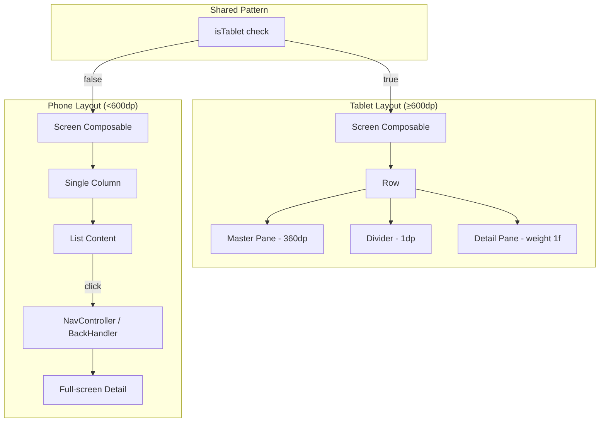
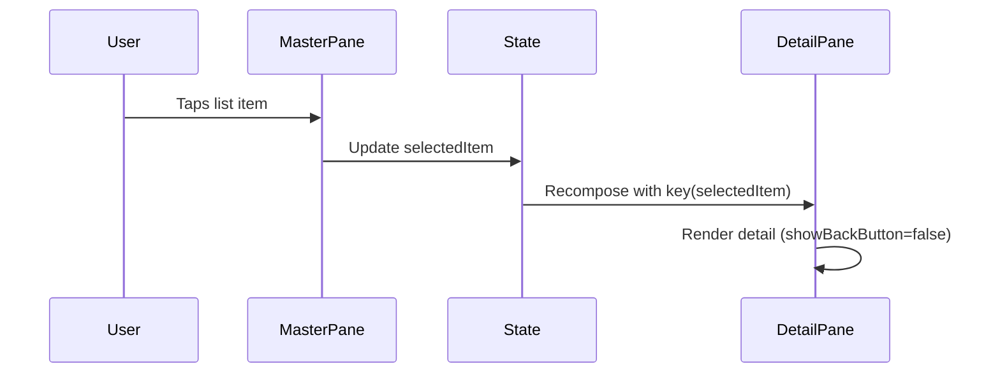

# Design Document: Tablet Master-Detail Layout

## Overview

This feature extends the existing master-detail layout pattern — already working on CalendarScreen — to three additional screens: Results, Drivers, and News. On tablet devices (≥600dp width), each screen renders a two-column `Row` with a fixed-width 360dp master pane on the left, a 1dp vertical divider, and a flexible-width detail pane on the right. On phones (<600dp), all screens retain their current navigation behavior unchanged.

The CalendarScreen implementation is the canonical reference: it uses `isTablet = LocalConfiguration.current.screenWidthDp >= 840` to branch between a `Row`-based master-detail layout and a single-column phone layout. The detail pane renders `TrackDetailScreen` inline with `showBackButton = false`, keyed on the selected round to reset scroll state on selection change.

### Design Decisions

1. **Threshold: 600dp vs 840dp** — CalendarScreen currently uses ≥840dp, but ResultsScreen and DriversScreen already use ≥600dp for tablet-aware sizing. This design standardises on **≥600dp** for the master-detail breakpoint across all four screens (including updating CalendarScreen for consistency). This matches the Material 3 medium window size class.

2. **Inline detail vs navigation** — On tablets, detail content renders inline in the detail pane. The `onRoundClick`, `onArticleClick`, and driver/team click callbacks become local state setters instead of NavController navigations. On phones, existing NavController-based (Results, News) and BackHandler-based (Drivers) navigation is preserved.

3. **Detail screen reuse** — Existing detail composables (`RoundResultsScreen`, `DriverDetailScreen`, `TeamDetailScreen`, `ArticleScreen`) are reused in the detail pane. Each needs a `showBackButton` parameter (defaulting to `true`) following the `TrackDetailScreen` pattern.

4. **Selection state** — Each screen manages a `selectedX` state variable (`selectedRound`, `selectedDriver`, `selectedTeam`, `selectedArticle`). The detail pane uses `key(selectedX)` to force recomposition and scroll state reset on selection change.

## Architecture



### Per-Screen Flow



## Components and Interfaces

### Shared Pattern

Each screen follows the same structural pattern inside its composable:

```kotlin
val isTablet = LocalConfiguration.current.screenWidthDp >= 600

if (isTablet) {
    Row(modifier = Modifier.fillMaxSize()) {
        // Master pane
        Box(modifier = Modifier.width(360.dp).fillMaxHeight()) {
            // Existing list content
        }
        // Divider
        Box(modifier = Modifier.width(1.dp).fillMaxHeight()
            .background(BtccOutline.copy(alpha = 0.3f)))
        // Detail pane
        Box(modifier = Modifier.weight(1f).fillMaxHeight()) {
            key(selectedItem) {
                DetailScreen(showBackButton = false, ...)
            }
        }
    }
} else {
    // Existing phone layout unchanged
}
```

### Results Screen Changes

**File:** `ResultsScreen.kt`

- Add `var selectedRound by remember { mutableStateOf<Pair<Int,Int>?>(null) }` (year, round)
- On tablet: wrap existing content in a `Row`. The left 360dp pane contains the full existing `Column` (TopAppBar, year selector, tabs, pager). The right pane renders `RoundResultsScreen` inline.
- The `onRoundClick` callback: on tablet, sets `selectedRound`; on phone, calls the existing navigation lambda.
- Default selection: most recent completed round, or `null` (showing a placeholder).

**RoundResultsScreen changes:**
- Add `showBackButton: Boolean = true` parameter
- Conditionally hide the back arrow `IconButton` and `BackHandler` when `showBackButton = false`

### Drivers Screen Changes

**File:** `DriversScreen.kt`

- On tablet: replace the current `when` block (which uses `BackHandler` for detail navigation) with a `Row`-based master-detail layout.
- Left pane: `GridTabs` composable (existing drivers/teams pager)
- Right pane: `DriverDetailScreen` or `TeamDetailScreen` based on selection, or a placeholder
- Add `selectedDriver` and `selectedTeam` state at the `DriversScreen` level (they already exist but are used for BackHandler navigation — on tablet they drive the detail pane instead)
- On phone: keep existing BackHandler-based navigation unchanged.

**DriverDetailScreen / TeamDetailScreen changes:**
- Add `showBackButton: Boolean = true` parameter to both
- Conditionally hide the back `IconButton` and `BackHandler` when `showBackButton = false`

### News Screen Changes

**File:** `NewsScreen.kt`

- Add `var selectedArticle by remember { mutableStateOf<Article?>(null) }` 
- On tablet: wrap the existing content in a `Row`. Left 360dp pane contains the full news feed (hero, grid, compact cards, search, FAB). Right pane renders `ArticleScreen` inline.
- The `onArticleClick` callback: on tablet, sets `selectedArticle` and updates `ArticleHolder.current`; on phone, calls the existing navigation lambda.
- Default: placeholder prompting user to select an article.

**ArticleScreen changes:**
- Add `showBackButton: Boolean = true` parameter
- Conditionally hide the back `IconButton` and `BackHandler` when `showBackButton = false`

### Navigation Changes

**File:** `AppNavigation.kt`

- The `ResultsScreen` composable call: on tablet, the `onRoundClick` lambda is handled internally (no NavController navigation). The `Screen.RoundResults` route still exists for phone navigation and deep links.
- The `NewsScreen` composable call: on tablet, `onArticleClick` is handled internally. The `Screen.Article` route still exists for phone and deep links.
- The `DriversScreen` composable call: no navigation changes needed (it already uses BackHandler, not NavController routes).
- Deep link handling in `MainActivity`: for tablet, when a deep link targets a detail screen (e.g., `Screen.RoundResults`), navigate to the parent screen and set the selection state. This requires passing selection state down or using a shared ViewModel.

### Placeholder Composable

A simple reusable placeholder for empty detail panes:

```kotlin
@Composable
fun DetailPlaceholder(message: String) {
    Box(
        modifier = Modifier.fillMaxSize().background(BtccBackground),
        contentAlignment = Alignment.Center,
    ) {
        Text(message, color = BtccTextSecondary, style = MaterialTheme.typography.bodyLarge)
    }
}
```

## Data Models

No new data models are required. The feature uses existing models:

- `RoundResult` / `RaceEntry` / `DriverResult` — for Results detail pane
- `Driver` / `Team` / `GridData` — for Drivers detail pane  
- `Article` — for News detail pane
- `Race` — already used by Calendar master-detail

### State Changes

Each screen adds local selection state:

| Screen | State Variable | Type | Default |
|--------|---------------|------|---------|
| ResultsScreen | `selectedRound` | `Pair<Int,Int>?` (year, round) | Most recent completed round or `null` |
| DriversScreen | `selectedDriver` / `selectedTeam` | `Driver?` / `Team?` | `null` (placeholder) |
| NewsScreen | `selectedArticle` | `Article?` | `null` (placeholder) |
| CalendarScreen | `selectedRound` | `Int?` | Next race round (existing) |


## Correctness Properties

*A property is a characteristic or behavior that should hold true across all valid executions of a system — essentially, a formal statement about what the system should do. Properties serve as the bridge between human-readable specifications and machine-verifiable correctness guarantees.*

The following properties were derived from the acceptance criteria after prework analysis and redundancy elimination. Many individual criteria tested the same underlying invariant (e.g., "renders master-detail on tablet" appeared in Requirements 1.1, 2.1, 3.1, 4.1–4.3), so they have been consolidated into comprehensive properties.

### Property 1: Master-detail layout structure on tablet

*For any* master-detail screen (Results, Drivers, News, Calendar) rendered at a screen width ≥600dp, the screen shall display a master pane of exactly 360dp width, a 1dp vertical divider, and a detail pane that fills the remaining horizontal space — all visible simultaneously.

**Validates: Requirements 1.1, 2.1, 3.1, 4.1, 4.2, 4.3**

### Property 2: Item selection updates detail pane inline on tablet

*For any* master-detail screen on a tablet device and *for any* selectable item (round, driver, team, or article), tapping that item shall update the detail pane to show the corresponding detail content without triggering a NavController route navigation.

**Validates: Requirements 1.2, 2.2, 2.3, 3.2, 5.1, 5.2**

### Property 3: Phone navigation behavior preserved

*For any* screen on a phone device (screen width <600dp) and *for any* selectable item, tapping that item shall trigger the existing navigation mechanism (NavController route for Results and News, BackHandler-based in-screen navigation for Drivers) — identical to the behavior before this feature.

**Validates: Requirements 1.3, 2.4, 3.3, 5.3**

### Property 4: Selection change resets detail pane

*For any* master-detail screen on a tablet device, when the selected item changes from item A to item B, the detail pane shall recompose with item B's content and the scroll position shall reset to the top.

**Validates: Requirements 4.4**

### Property 5: Back button visibility controlled by showBackButton parameter

*For any* detail screen (RoundResultsScreen, DriverDetailScreen, TeamDetailScreen, ArticleScreen), when rendered with `showBackButton = false` the back navigation button shall not be displayed, and when rendered with `showBackButton = true` the back navigation button shall be displayed.

**Validates: Requirements 6.1, 6.2**

## Error Handling

### Detail Pane Loading Errors

- If the detail content fails to load (e.g., network error for RoundResultsScreen or ArticleScreen), the detail pane displays the detail screen's existing error state. No changes to existing error handling are needed since the detail composables already handle their own error states.

### Empty/Null Selection

- When no item is selected (initial load or after data refresh clears selection), the detail pane shows a `DetailPlaceholder` composable with a contextual message (e.g., "Select a round to view results").

### Configuration Changes

- Selection state uses `remember` (not `rememberSaveable`) since the master-detail vs phone layout may change on configuration change (e.g., foldable device fold/unfold). On layout change, selection resets to default, which is acceptable.

### Deep Link on Tablet

- If a deep link targets `Screen.RoundResults` on a tablet, `MainActivity` navigates to `Screen.Results` and passes the round as a parameter. The ResultsScreen reads this parameter and sets `selectedRound` accordingly. Same pattern for article deep links.
- If the deep link data is invalid (e.g., round doesn't exist), the detail pane shows the existing "not found" error state from the detail screen.

## Testing Strategy

### Unit Tests

Unit tests verify specific examples and edge cases:

- **Initial state**: Each screen on tablet shows the correct default (placeholder or pre-selected item)
- **Phone layout**: Each screen on phone renders single-column layout without a detail pane
- **Placeholder display**: Detail pane shows placeholder text when no item is selected
- **Deep link handling**: Tablet deep link to a specific round/article navigates to parent screen with correct selection
- **Existing functionality preserved**: Tabs, year selector, search, pull-to-refresh, FAB all remain functional in the master pane

### Property-Based Tests

Property-based tests verify universal properties across generated inputs. Use **Kotest** with its property-based testing module (`kotest-property`) for Kotlin/Android.

Each property test must:
- Run a minimum of **100 iterations**
- Reference the design property with a tag comment
- Use a single property-based test per correctness property

Configuration:
```kotlin
// build.gradle.kts
testImplementation("io.kotest:kotest-property:5.8.0")
testImplementation("io.kotest:kotest-runner-junit5:5.8.0")
```

Property test mapping:

| Property | Test Description | Generator Strategy |
|----------|-----------------|-------------------|
| Property 1 | Render each screen at random widths ≥600dp, assert master+divider+detail structure | `Arb.int(600..1200)` for screen width × `Arb.enum<ScreenType>()` |
| Property 2 | For each screen type, generate random item selections, verify detail pane updates and no NavController call | `Arb.enum<ScreenType>()` × random item from list |
| Property 3 | Render each screen at random widths <600dp, tap items, verify navigation callback invoked | `Arb.int(320..599)` for screen width × random item |
| Property 4 | Select item A then item B, verify detail content changes and scroll position resets | Random pairs of distinct items per screen |
| Property 5 | Render each detail screen with `showBackButton` in `{true, false}`, verify back button visibility | `Arb.boolean()` × `Arb.enum<DetailScreenType>()` |

Tag format example:
```kotlin
// Feature: tablet-master-detail, Property 1: Master-detail layout structure on tablet
```
